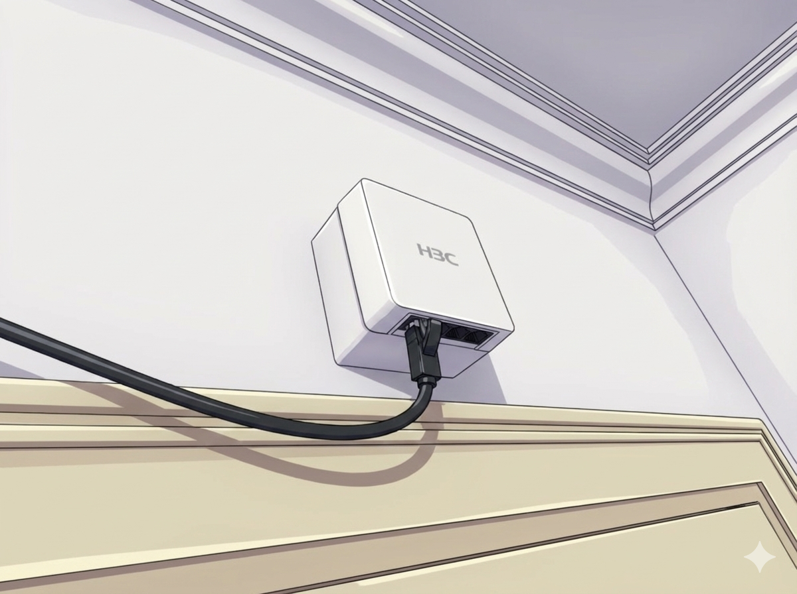
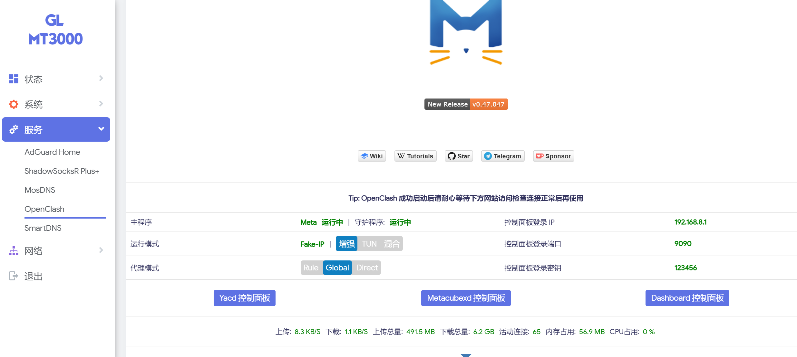

# 背景

国内某高校的校园网是需要付费的。以前很贵，现在是0.25元1G/每月免费30G 💸，节假日免费，图书馆等区域免费（可是现在有限速）。
如果囊中羞涩、或者对速度颇有微词，则我们与其节流，不如开源。💦

# 前置知识

我们的blog总是会先说一些没用的小知识，和文章不一定有关系，传统艺能。[^1]

[^1]: 这个就和博客前面一定要放一张二次元封面是同样的道理。

## 代理种类

可以思考一下，Clash中不同代理模式有什么区别？代理的实现原理是什么？
为什么git代理要单独设置才生效？

|模式名称|工作层级|兼容性|核心原理|
|-----|-----|-----|-----|
|环境变量 (export)|应用/会话层|中（主要针对终端工具）|通过系统变量告知程序代理服务器地址。|
|系统代理|应用层|中（仅限遵循系统设置的应用）|修改系统注册表/设置，提示应用使用代理。|
|TUN 模式|网络层|极高（全局流量捕捉）|创建虚拟网卡，修改路由表，拦截所有 IP 包。|
|TAP 模式|数据链路层|高|模拟以太网卡，处理 MAC 帧。|

## Wi-Fi标准

| Wi-Fi 代号 | IEEE 标准 | 发布年份 | 最高理论速率 | 工作频段 | 关键特性 |
| :--- | :--- | :--- | :--- | :--- | :--- |
| **(Legacy)** | 802.11 | 1997 | 2 Mbps | 2.4 GHz | 原始标准，现已淘汰 |
| **Wi-Fi 1** | 802.11b | 1999 | 11 Mbps | 2.4 GHz | 首次广泛普及，抗干扰能力弱 |
| **Wi-Fi 2** | 802.11a | 1999 | 54 Mbps | 5 GHz | 速率提升，但 5G 信号穿墙弱 |
| **Wi-Fi 3** | 802.11g | 2003 | 54 Mbps | 2.4 GHz | 兼容 11b，主流应用长达数年 |
| **Wi-Fi 4** | 802.11n | 2009 | 600 Mbps | 2.4 / 5 GHz | **引入 MIMO (多天线)**，双频支持 |
| **Wi-Fi 5** | 802.11ac | 2013 | 6.9 Gbps | 5 GHz | **引入 MU-MIMO**，进入千兆时代 |
| **Wi-Fi 6** | 802.11ax | 2019 | 9.6 Gbps | 2.4 / 5 GHz | **引入 OFDMA**，大幅提升高密度效率 |
| **Wi-Fi 6E** | 802.11ax | 2021 | 9.6 Gbps | 2.4 / 5 / 6 GHz | **新增 6GHz 频段**，超低延迟 |
| **Wi-Fi 7** | 802.11be | 2024 | 46 Gbps | 2.4 / 5 / 6 GHz | **MLO (多链路操作)**，320MHz 频宽 |
| **Wi-Fi 8** | 802.11bn | *开发中* | >46 Gbps | 2.4 / 5 / 6 GHz | 重点提升高可靠性 (UHR) |

# 探索流程

## 宿舍里的神秘AP

其实学校又挤又小的宿舍里，还附带了一个H3C的面板式无线AP，带有4个网口。
于是顺理成章的，每个人理论上拉一条网线，就可以接电脑上网了。
但是这个设备只能接入学校内网，不能上外网。
但是有聪明的小伙伴发现，学校是有免费上网区域的，比如实验室工位、服务器等所在的都是免费区域。
那么显然，我们可以代理工位的PC，由此来实现上网自由。



## 代理服务器

代理服务器我选择了简单的`3proxy`。配置仅供参考。

我们让工位机器开启SOCKS代理。同时，我设置了两个用户，一个直接代理，一个走`7890`端口代理。所以，切换这两个用户，相当于是否启用魔法——这么做可以省一点魔力。
以下我将工位的IP地址以`A.B.C.D`代替。
这个IP地址可能在你DHCP后会变，但一般你工位机器不会长时间关闭，所以我只换过一次。

```yml
# 超时的时间值
timeouts 1 5 30 60 180 1800 15 60
 
# 设置用户名和密码，可以设置多个
users "shy:CL:123" "nameless:CL:321"

# 在windows上作为服务启动
service


# 内部IP地址，不可使用127.0.0.1，要具体地址，这里填你的电脑ip地址
internal A.B.C.D

#################################
#### socks4/4.5/5 proxy setting
#################################
# 认证
auth strong
# 允许配置的用户连接
allow shy
allow nameless
parent 1000 connect+ 127.0.0.1 7890
#fakeresolve
# 这里手动指定端口1080
socks -p1080
proxy -p1081
flush
```

## 代理客户端

笔者选择了`Clash`作为代理的客户端。对应代理服务器，写下配置。

我在我目前用的版本上，去掉了冗余的部分（一些广告过滤规则），主体配置就是如下。
我们可以在规则模式下，切换不同用户来实现我们的目标，也可以用一些规则做网站匹配自动选择。

```yml
mixed-port: 7890
allow-lan: true
bind-address: "*"
mode: rule
log-level: info
external-controller: 127.0.0.1:9090
dns:
  enable: true
  ipv6: false
  default-nameserver:
    - 223.5.5.5
    - 119.29.29.29
  enhanced-mode: fake-ip
  fake-ip-range: 198.18.0.1/16
  use-hosts: true
  nameserver:
    - https://doh.pub/dns-query
    - https://dns.alidns.com/dns-query
  fallback:
    - https://doh.dns.sb/dns-query
    - https://dns.cloudflare.com/dns-query
    - https://dns.twnic.tw/dns-query
    - tls://8.8.4.4:853
  fallback-filter:
    geoip: true
    ipcidr:
      - 240.0.0.0/4
      - 0.0.0.0/32
proxies:
  - name: socks5-shy
    type: socks5
    server: A.B.C.D
    port: 1080
    username: shy
    password: 123
  - name: socks5-nameless
    type: socks5
    server: A.B.C.D
    port: 1080
    username: nameless
    password: 321
proxy-groups:
  - name: auto-select
    type: select
    proxies:
      - socks5-shy
      - socks5-nameless
    interval: 86400

rules:
  - DOMAIN-SUFFIX,bing.com,socks5-shy
  - DOMAIN-SUFFIX,github.com,socks5-nameless
  - DOMAIN-SUFFIX,google.com,socks5-nameless
  - DOMAIN-SUFFIX,zhihu.com,socks5-shy
  - DOMAIN-SUFFIX,baidu.com,socks5-shy
  - DOMAIN-SUFFIX,bilibili.com,socks5-shy
  - MATCH,auto-select

```

## 更进一步，速度？

其实有了这份配置，我们只要在安卓手机端用`Clash Meta`，PC端用`Clash Verge`，iOS端用`Streisand`（当时我好像用的是`V2Box`，搭配一个可以连SOCKS客户端），SteamDeck用`ToMoon`就行了。但是，经过测试（凭记忆，没截图可能没说服力，这篇文章也是我两年后补写的，因为一直用着没再管了），无线网络的速度一般在`150Mbps`左右。而我们的工位机器可以跑到`800Mbps`左右，拉一条宿舍网线的代理，宿舍电脑就可以跑到`600Mbps`左右了。

## 更进一步，全家桶？

有些产品在设计连Wi-Fi时，无法连接像校园网这样有用户验证的网络。还有些设备，处理`Clash`配置不方便（比如iPhone、iPad，或者说App要钱）。那么，我就购置了一台小巧的无线路由器（GLINET-MT3000，非广告。类似的更便宜的后来有出Cudy-AX3000等，我在实习时给出租屋买了这个试试），这种路由器只需要typec供电，甚至可以USB来获取手机的网络等。选择这种偏贵的路由器，还有个理由是它自己就带了OpenWRT，省的我刷系统麻烦。刷了系统后，ssh连上（可以先配置一个看得过去的中文面板），按照网上的教程去安装`OpenClash`，选好`mihomo`内核。那么我们就在路由器里配置上了我们的代理，然后把网线接到路由器的网口，我们的其它设备（诸如手机、平板、电脑、游戏机）就可以连我们的Wi-Fi来一起上网自由了。只不过切换魔法时，是全局生效的。

但这个方案也不是完美的，有时候登录游戏、抖音切换到用户页时，会有长达十几秒的延迟。至今我也没找到确切的原因，只能归结于工位电脑有时会卡吧。



# 总结

当某校学子登上一座山后，发现其他高校的学生早就坐在山顶了。

至于这么做<span style="color: #1E90FF;">学校</span>或者<span style="color: #ff4500;">导师</span>会不会找你，我目前没碰到。