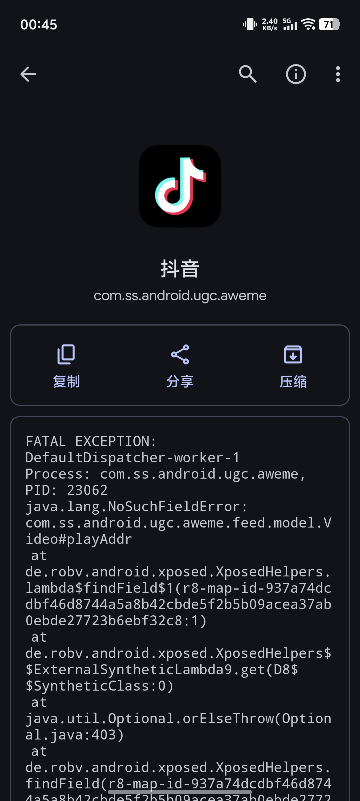
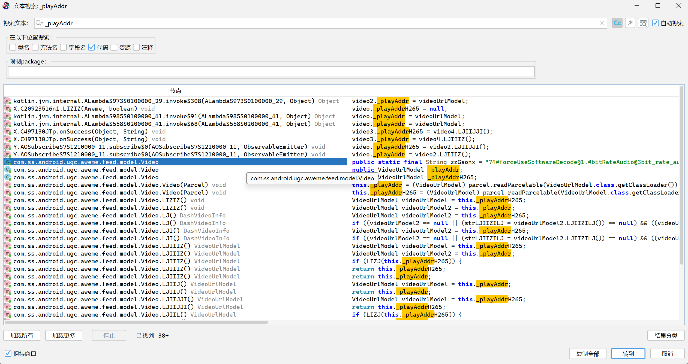
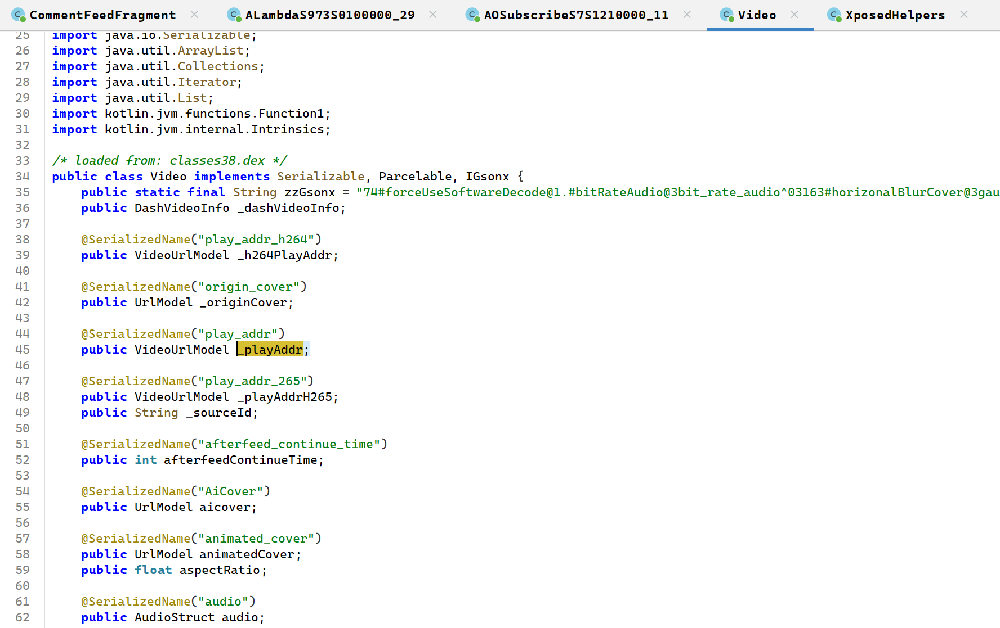
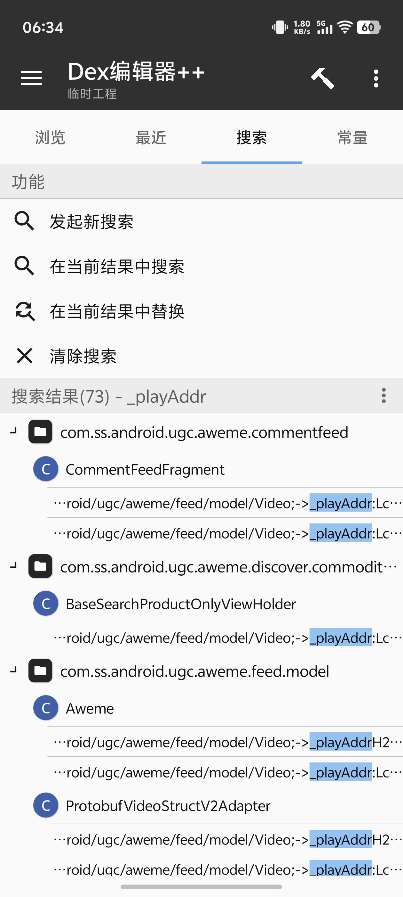
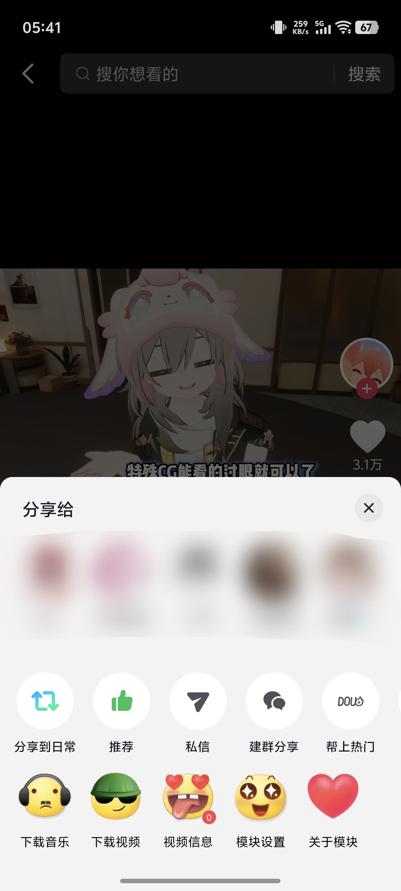

# 背景

某国内短视频平台的下载功能可能不开放，也可能有水印。
虽然可以通过转发-复制链接来解析（比如类似Snaptube的app，或者开发者工具去找视频直链），但过程麻烦，使用模块则可以快速保存无水印视频。
此外，抖音模块版还有其它实用功能，比如过滤视频类型（如广告、直播）、隐藏控件（如拍摄、推荐）等。

之前一直使用带有Freedom+、逗音小能手双模块的抖音35.5.0版本，但由于一些BUG，
导致逗音小能手在后期已不可用，Freedom+则会把双击点赞替换掉且更改无效，以及识图时会强制人脸识别。
因此，试图更新一下。

截至实验时抖音的最新版已达到37.3.0，而网上发布的有注入模块的apk最高版本已达到37.2.0。
可是经过实际下载安装，发现其中低版本不可登录，而高版本有BUG：在下载视频时会闪退。
本人仅上过编译原理，此前不懂安卓开发，但可以凭借仅有的知识配合LLM，修复此模块的BUG。


# 前置知识

## 安卓权限

本次操作无需Root权限。

简要说明Shizuku的原理。当安卓手机用数据线连接PC进行调试时，可以用adb命令去执行一些有更高权限的指令。
同时一般的安卓支持无线调试（我之前在华为的Matepad上用旧的鸿蒙系统还不支持无线调试），
所以可以用手机自己调试自己，来获得等同于adb能力的权限。
但是adb权限不等同于root权限，依然做不到某些能力。
比如没有root权限的情况下，仍然不能无视签名覆盖安装app。

无特殊需求可不用Dizuku。

### 全局注入框架（需root）

这类框架通过修改系统底层进程，实现对整台设备所有 App 的注入。

|框架名称|作用与特点|现状|
|-----|-----|-----|
|<div style="width: 70px">XPosed</div>|现代 Android 插件化框架的鼻祖。通过替换 /system/bin/app_process 启动文件来接管系统。|已停更。不兼容 Android 8.0 以上的新版本。|
|LSPosed|目前 XPosed 的主流继承者。基于 Riru 或 Zygisk，修复了原版 XPosed 耗电、不稳定的问题。|当前主流。支持最新 Android 版本，安全性极高，支持“作用域”功能。|

### 免root注入方案

这类框架不需要 Root 权限，它们通过修改目标 App 的 APK 文件或运行环境，让插件“寄生”在 App 内部。

|框架名称|实现原理|适用场景|
|-----|-----|-----|
|<div style="width: 70px">LSPatch</div>|核心推荐。它将 LSPosed 的核心功能打包进目标 App 的 APK 里。|想在没 Root 的手机上用特定的 XPosed 模块（如修改某个 App 的界面）。|
|OPatch|类似于LSPatch，但它更注重于“补丁化”。通常用于绕过签名验证或特定的 API 限制。|针对特定 App 的破解或深度定制。|

不过因为已经有提供成品apk了，所以上述工具在此次不会用到。而且我也不会。

## 签名

抖音会拒绝低版本和非官方渠道的apk的登录。
所以假设我们的安卓手机没有root权限，一般网上的方法就是，
下载一个对应或更低的官方版本（豌豆荚等可下载历史版本的抖音），用MT管理器去除签名校验后安装官方版抖音，
在官方版抖音中登录，再覆盖升级模块版抖音，此时则可继续正常使用。

根据我的试验，最低的去除签名校验后的可登录版本目前是36.4.0。
不去除签名校验的官方版，可能更早的也能登录。


### V1, V2, V3, V4 有什么区别？

这些是 Android 签名方案的迭代版本。版本越高，安装校验越快，安全性越强。

|版本|称呼|特点|
|-----|-----|-----|
|<div style="width: 30px">V1</div>|<div style="width: 175px">基于 JAR 签名</div>|最老版本。它只校验 APK 里的单个文件。缺点是安装慢，且可以被通过某些手段修改 APK 结构（不改文件内容）来绕过。|
|V2|全栈签名 (Android 7.0+)|主流标准。它不再校验单个文件，而是校验整个 APK 文件块。由于不需要解压再校验，安装速度极大提升。|
|V3|签名轮转 (Android 9.0+)|进阶版。它允许开发者更换签名密钥的同时，依然保持与旧版的关联。解决“开发者想换密钥但不想让用户丢数据”的问题。|
|V4|流式传输签名 (Android 11+)|辅助版。主要配合 ADB 增量安装使用，减少大型游戏（如原神）的安装等待时间。|

MT 里的操作建议： 在使用 MT 管理器签名时，通常建议全勾选 (V1+V2+V3)，以获得最佳的手机兼容性。

### 去除签名校验

很多 App 内部会有二次检测：它们运行时会检查自己的身份证（签名），发现不是原作者的，就会闪退或报错。

MT 会自动修改应用的 classes.dex 代码，通过 Hook（钩子）技术，让应用在调用“获取签名”的方法时，返回一个伪造的原厂签名数据，骗过 App 自己的检查。

# 修复过程

首先我们得定位问题在哪，也就是用

```shell
adb logcat
```

来获取报错的信息。
此时我们也可以用 [LogFox](https://github.com/F0x1d/LogFox) 这款软件，在Shizuku的加持下，它可以获得报错内容：




```log
FATAL EXCEPTION: DefaultDispatcher-worker-1
Process: com.ss.android.ugc.aweme, PID: 23062
java.lang.NoSuchFieldError: com.ss.android.ugc.aweme.feed.model.Video#playAddr
	at de.robv.android.xposed.XposedHelpers.lambda$findField$1(r8-map-id-937a74dcdbf46d8744a5a8b42cbde5f2b5b09acea37ab0ebde27723b6ebf32c8:1)
	at de.robv.android.xposed.XposedHelpers$$ExternalSyntheticLambda9.get(D8$$SyntheticClass:0)
	at java.util.Optional.orElseThrow(Optional.java:403)
	at de.robv.android.xposed.XposedHelpers.findField(r8-map-id-937a74dcdbf46d8744a5a8b42cbde5f2b5b09acea37ab0ebde27723b6ebf32c8:11)
	at de.robv.android.xposed.XposedHelpers.getObjectField(r8-map-id-937a74dcdbf46d8744a5a8b42cbde5f2b5b09acea37ab0ebde27723b6ebf32c8:1)
	at ޅޕޕ.ފ(r8-map-id-9d31031410a02d2db4118ad440deb20aa79da2b479cf4e5d78532dccf8528c02:78)
	at ލޙ.ޚ(r8-map-id-9d31031410a02d2db4118ad440deb20aa79da2b479cf4e5d78532dccf8528c02:8)
	at ށޕޙ.run(r8-map-id-9d31031410a02d2db4118ad440deb20aa79da2b479cf4e5d78532dccf8528c02:121)
	at ޠމ.run(r8-map-id-9d31031410a02d2db4118ad440deb20aa79da2b479cf4e5d78532dccf8528c02:48)
	at ޅދޙ.run(r8-map-id-9d31031410a02d2db4118ad440deb20aa79da2b479cf4e5d78532dccf8528c02:3)
	at ހގގ.run(r8-map-id-9d31031410a02d2db4118ad440deb20aa79da2b479cf4e5d78532dccf8528c02:90)
	Suppressed: ށޚގ: [ޅވޙ{Cancelling}@f6aebf8, Dispatchers.IO]
```

此时我们发现，注入逻辑中的类名是特殊字符，而且很多名字被做r8混淆了，主要的报错意思是找不到`playAddr`这个字段。
那么一个显然的猜测就是，在抖音更新的过程中，这个字段被修改了。




用jadx-gui反编译整个apk，获取java源码。通过观察可知，`com.ss.android.ugc.aweme.feed.model.Video`类下的字段被改成了`_playAddr`。那么我们的目标就很简单了，假设只有这一个错误，那么只需要修复这个字段找不到的问题即可。

然后下一步就是找到注入逻辑的代码在哪，很可惜，我没有找到。根据和历史官方版本的对比，我们发现模块版多出了`classes58.dex`和`classes59.dex`这两个文件。然后根据其中的代码，发现一段`androidx/app/Init`下的逻辑：

```java
package androidx.app;

import android.app.ActivityThread;
import java.io.ByteArrayOutputStream;
import java.io.InputStream;
import java.lang.reflect.Method;
import java.util.HashMap;
import java.util.Objects;

/* compiled from: r8-map-id-263f66dcf0730642da01f160461ad288129278808ca9a44c1aa61631eb2ce884 */
/* loaded from: classes59.dex */
public class Init {
    public static final HashMap a = new HashMap(4);
    public static byte[] dex;

    public Init() {
        if (ActivityThread.currentActivityThread() == null) {
            return;
        }
        try {
            HashMap map = a;
            map.put("arm", "armeabi-v7a");
            map.put("arm64", "arm64-v8a");
            map.put("x86", "x86");
            map.put("x86_64", "x86_64");
            ClassLoader classLoader = Init.class.getClassLoader();
            Objects.requireNonNull(classLoader);
            Class<?> cls = Class.forName("dalvik.system.VMRuntime");
            Method declaredMethod = cls.getDeclaredMethod("getRuntime", null);
            declaredMethod.setAccessible(true);
            Method declaredMethod2 = cls.getDeclaredMethod("vmInstructionSet", null);
            declaredMethod2.setAccessible(true);
            String str = (String) map.get((String) declaredMethod2.invoke(declaredMethod.invoke(null, null), null));
            InputStream resourceAsStream = classLoader.getResourceAsStream("assets/hkp/loader.dex");
            try {
                ByteArrayOutputStream byteArrayOutputStream = new ByteArrayOutputStream();
                try {
                    byte[] bArr = new byte[8192];
                    while (true) {
                        int i = resourceAsStream.read(bArr);
                        if (-1 == i) {
                            dex = byteArrayOutputStream.toByteArray();
                            byteArrayOutputStream.close();
                            resourceAsStream.close();
                            System.load(classLoader.getResource("assets/hkp/so/" + str + "/libhkp.so").getPath().substring(5));
                            return;
                        }
                        byteArrayOutputStream.write(bArr, 0, i);
                    }
                } finally {
                }
            } finally {
            }
        } catch (Throwable th) {
            throw new ExceptionInInitializerError(th);
        }
    }
}
```

也就是说，有可能注入逻辑被藏在了`assets/hkp/loader.dex`或者`libhkp.so`这个arm库中了（笔者是armv8a）。很可惜，我在`loader.dex`中没发现`playAddr`字样，同时也猜测它只是一个导入用的壳，实际的逻辑可能还隐匿在其它地方。而动态库的反编译相比Smali（Android下Dalvik虚拟机支持的字节码的可读版）过于复杂，我看不下去。

但是我们可以另辟蹊径，既然修改模块逻辑不行，我们可以直接修改抖音本体的逻辑。一开始我给`Video`类加了一个字段`playAddr`，并且让七十多处对`_playAddr`的赋值逻辑同时也给`playAddr`赋值，这样同步后，`playAddr`相当于是`_playAddr`的马甲了，于是就可以读到值了，抖音也不闪退了。但是这样有一个问题，只有主页的视频可以下载，而搜索页、收藏页等视频下载会报错。这就奇怪了，到底哪里没赋值呢，这边我又作出一个猜测，即其它页面的视频是通过GSON序列化过来的，于是不会给playAddr赋值。那么又有一个简单的想法，我把代码中所有`_playAddr`替换成`playAddr`那不就行了吗（虽然还有`_playAddrH265`，但也不影响）。果然，这样替换很简单，在MT管理器中用Dex++编辑器一键就能做到，而且也不再有问题了。


# 总结

一个简单快乐的解决问题的流程记录。


本文使用的版本来自于[这里](https://www.gndown.com/3905.html)。
根据著作权，修改他人应用程序为违法，本文谨用于技术学习，切勿传播与非法用途。
如若试验中遭遇账号封禁等损失一概与笔者无关，后果自负。